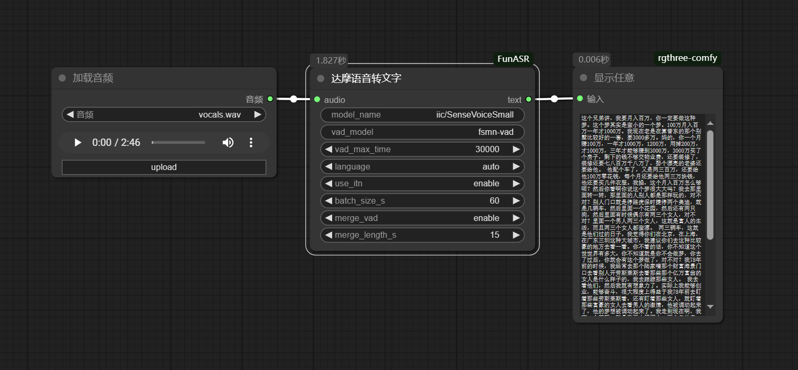

# ComfyUI-FunASR 语音识别节点

## 功能描述

达摩语音识别节点提供基于FunASR框架的语音转文字功能，支持：

- 多语言自动识别（中文/英文/粤语/日语/韩语）
- 长音频自动分段处理
- 实时语音活性检测（VAD）
- 智能文本后处理（ITN）
- 极速处理，使用GTX1660，2s可处理2分钟的音频


### 作者: 盒子AI
### 更多资源：[https://mgkjgw.top](https://mgkjgw.top)  


## 安装方法

1. 将本节点目录放置在 `ComfyUI/custom_nodes/` 下
2. (可选)安装依赖(会自动安装，除非安装失败才需要手动安装)：

```bash
pip install funasr modelscope
```

## 使用说明

1. 连接音频输入（支持直接输入或音频文件路径）
2. 选择语音识别模型（默认：SenseVoiceSmall）
3. 配置VAD参数和语言选项
4. 执行节点获取识别结果

## 参数配置详解

| 参数项           | 类型           | 默认值              | 说明                   |
| ------------------ | ---------------- | --------------------- | ------------------------ |
| 音频输入         | AUDIO          | -                   | 支持波形数据或文件路径 |
| 模型名称         | string         | iic/SenseVoiceSmall | 语音识别模型路径       |
## 模型下载指引

1. 推荐模型：
   - SenseVoiceSmall：`iic/SenseVoiceSmall`
   - FSMN-VAD：`iic/speech_fsmn_vad_zh-cn-16k-common-pytorch`
2. 模型自动下载到 `ComfyUI-FunASR/models/` 目录
3. 手动下载地址：[ModelScope](https://modelscope.cn/models/iic/SenseVoiceSmall)

## 示例输出  




## 注意事项

- 首次使用会自动下载模型文件（约2-3GB）
- 建议使用NVIDIA显卡加速运算
- 长音频处理可能需要较大内存
- 测试环境：  
